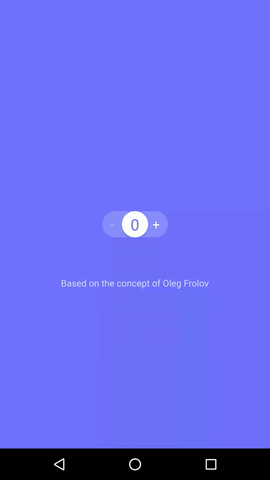

# Stepper-Touch


[](http://twitter.com/dionsegijn)  [](https://github.com/KotlinBy/awesome-kotlin)


Stepper Touch for Android based on a Material Up showcase designed by [Oleg Frolov](https://material.uplabs.com/posts/stepper-touch-interface)

In the latest version of the support library (25.3.0) a new class SpringAnimation was made available. I wanted to test this out and not long after that I found Stepper Touch, a concept made in FramerJS, on Material Up. I took this oppertunity to play with SpringAnimations.

[]()

Try it yourself:

[](https://play.google.com/store/apps/details?id=nl.dionsegijn.steppertouchdemo)

## Gradle

* Step 1. Add the JitPack repository to your build file

```gradle
allprojects {
    repositories {
        ...
        maven { url 'https://jitpack.io' }
    }
}
```

* Step 2. Add the dependency

```gradle
dependencies {
	compile 'com.github.DanielMartinus:Stepper-Touch:0.6'
}
```

## Implement

```XML
<nl.dionsegijn.steppertouch.StepperTouch
        android:id="@+id/stepperTouch"
        android:layout_width="100dp"
        android:layout_height="40dp" />
```

Quick example written in Kotlin:

```Kotlin
val stepperTouch = findViewById(R.id.stepperTouch) as StepperTouch
stepperTouch.stepper.setMin(0)
stepperTouch.stepper.setMax(3)
stepperTouch.stepper.addStepCallback(object : OnStepCallback {
	override fun onStep(value: Int, positive: Boolean) {
    	Toast.makeText(applicationContext, value.toString(), Toast.LENGTH_SHORT).show()
	}
})
```

Quick example written in Java:

```Java
StepperTouch stepperTouch = (StepperTouch) findViewById(R.id.stepperTouch);
        stepperTouch.stepper.setMin(0);
        stepperTouch.stepper.setMax(3);
        stepperTouch.stepper.addStepCallback(new OnStepCallback() {
            @Override
            public void onStep(int value, boolean positive) {
                Toast.makeText(getApplicationContext(), value + "", Toast.LENGTH_SHORT).show();
            }
        });
```

You are able to further customize or set initial values with styled attributes: 

Add res-auto to your xml layout if you haven't yet
 
```XML
xmlns:app="http://schemas.android.com/apk/res-auto"
``` 

After that the following attributes will become available:

```XML
app:stepperBackgroundColor=""
app:stepperButtonColor=""
app:stepperActionsColor=""
app:stepperActionsDisabledColor=""
app:stepperTextColor=""
app:stepperTextSize=""
```
